717 Studio is an architecture, interior and lighting design company, was established by experienced architects who had worked for several global design firms. Their philosophy is very understandable: "Make thing simple, but not simpler"

_Client: 717 Architects · Project: Editorial · Location: HCMC, Vietnam · Time: 2018_

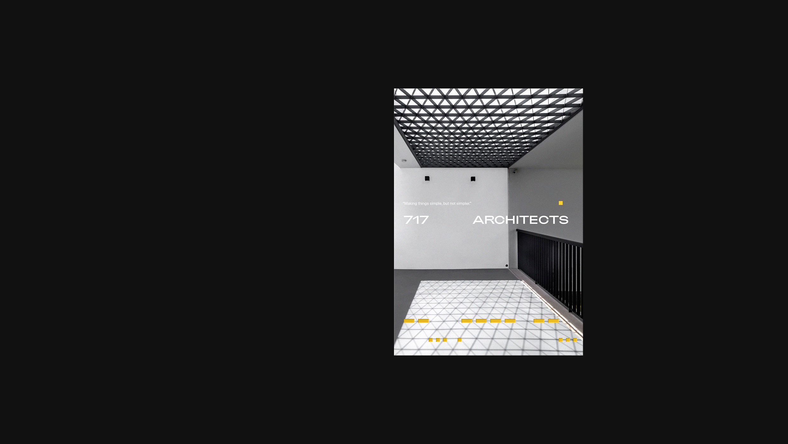

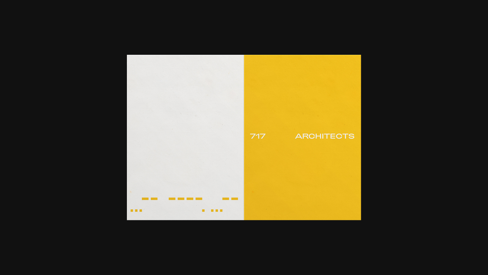

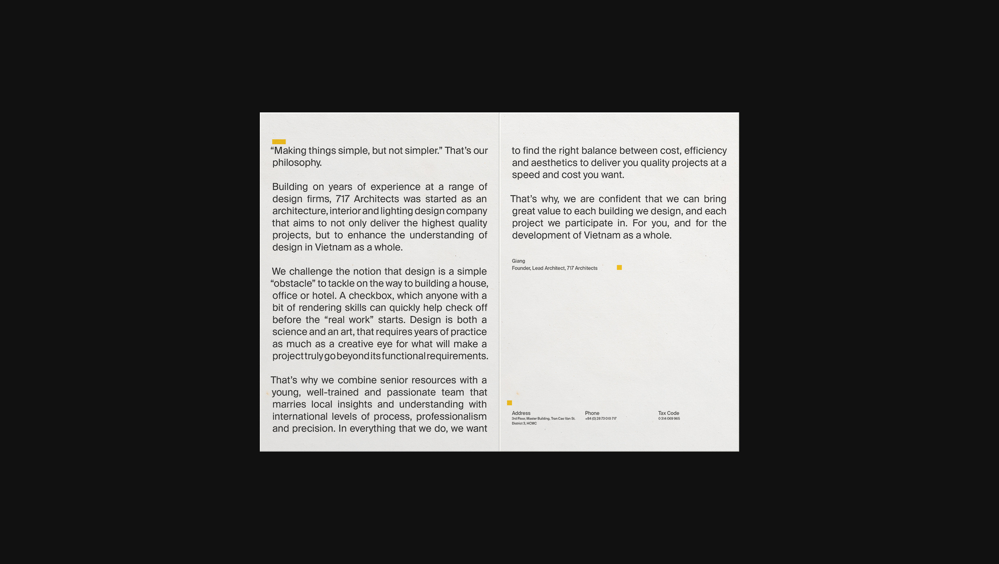

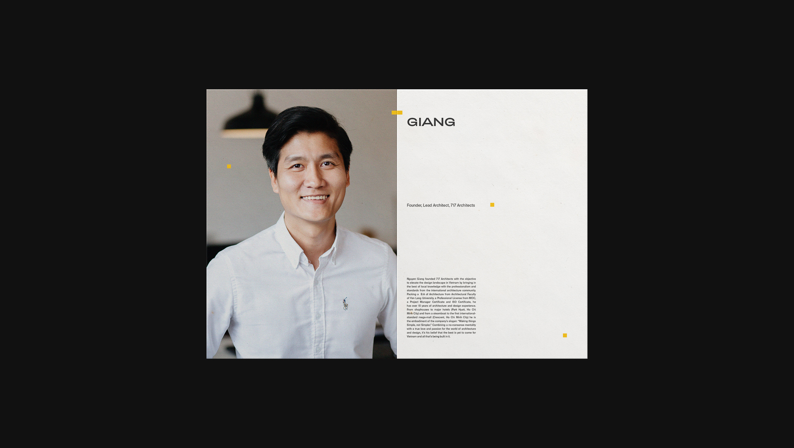

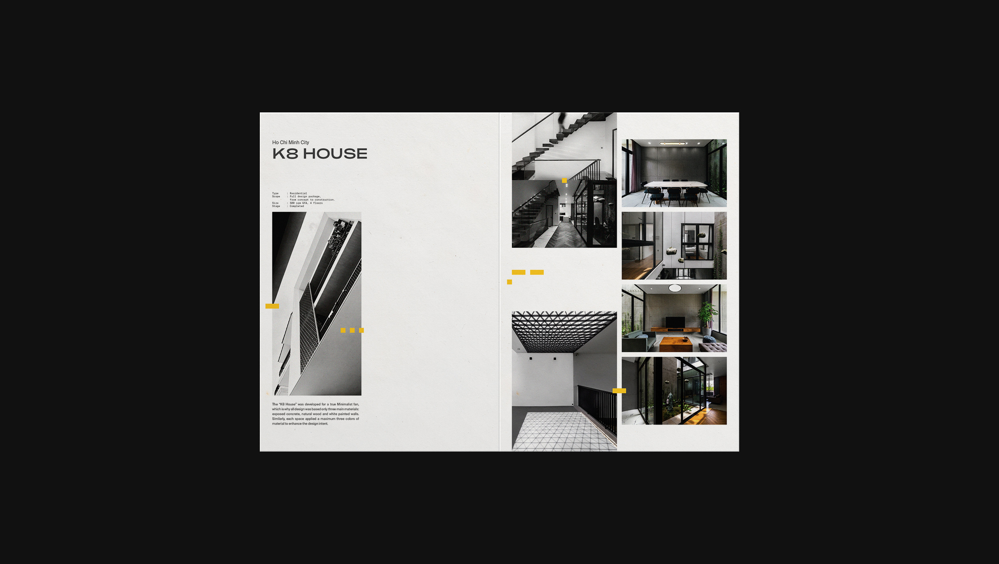

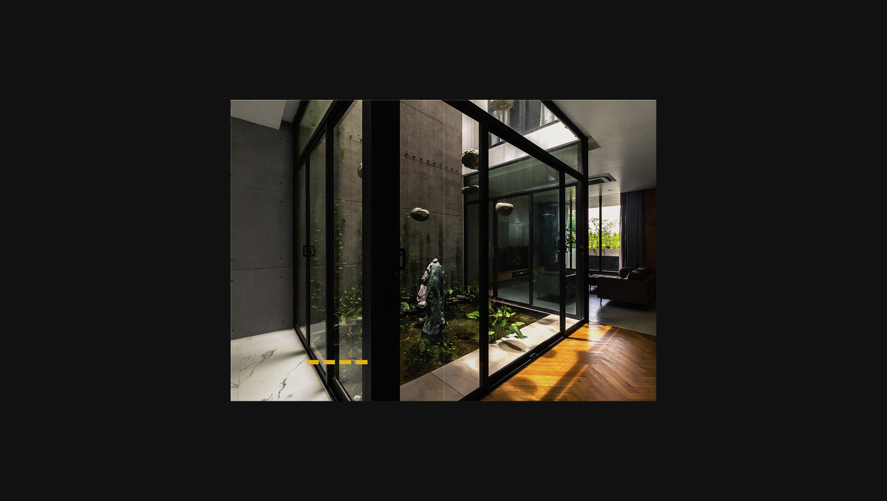

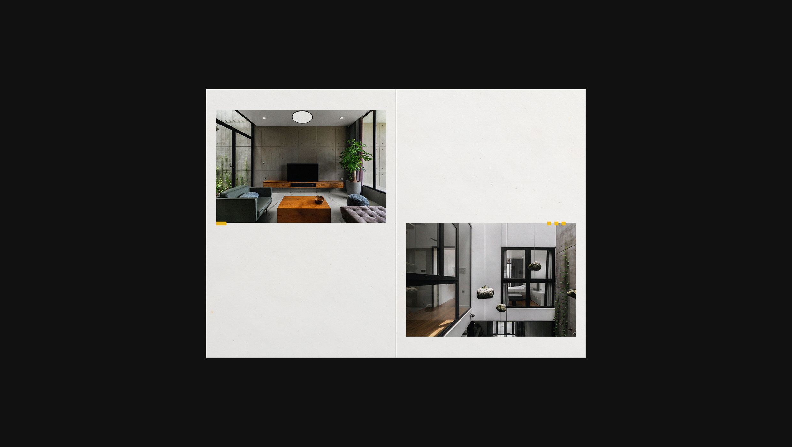

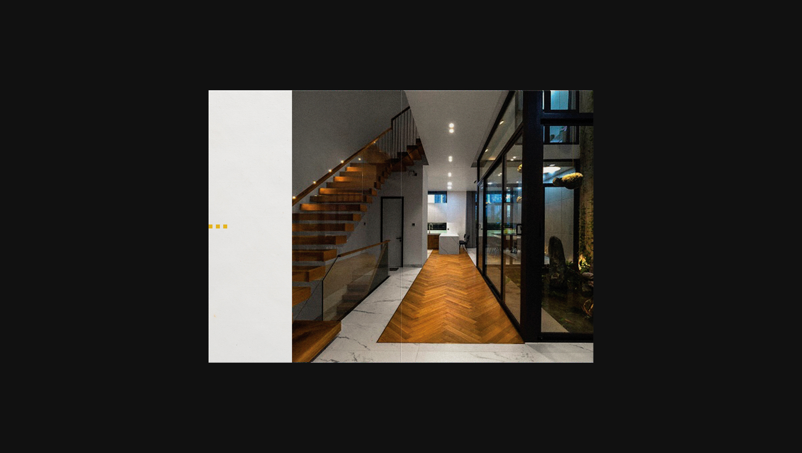

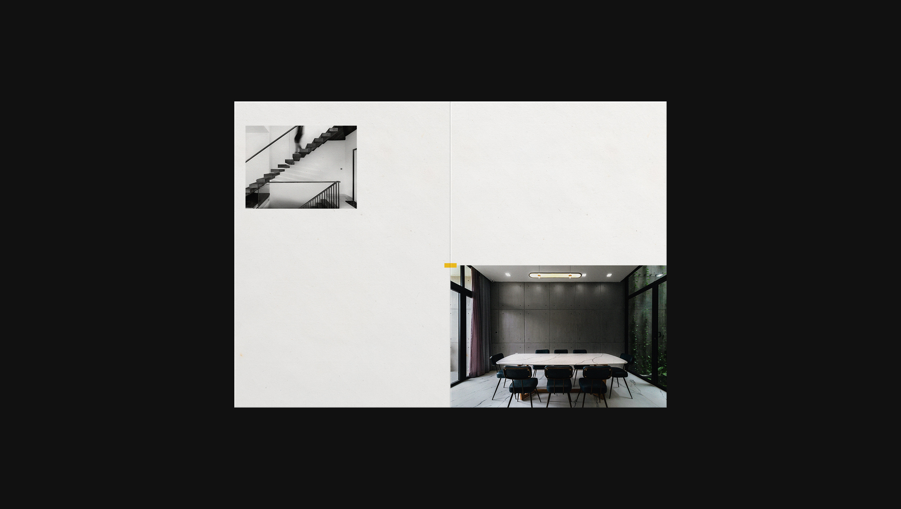

<!-- 2col -->

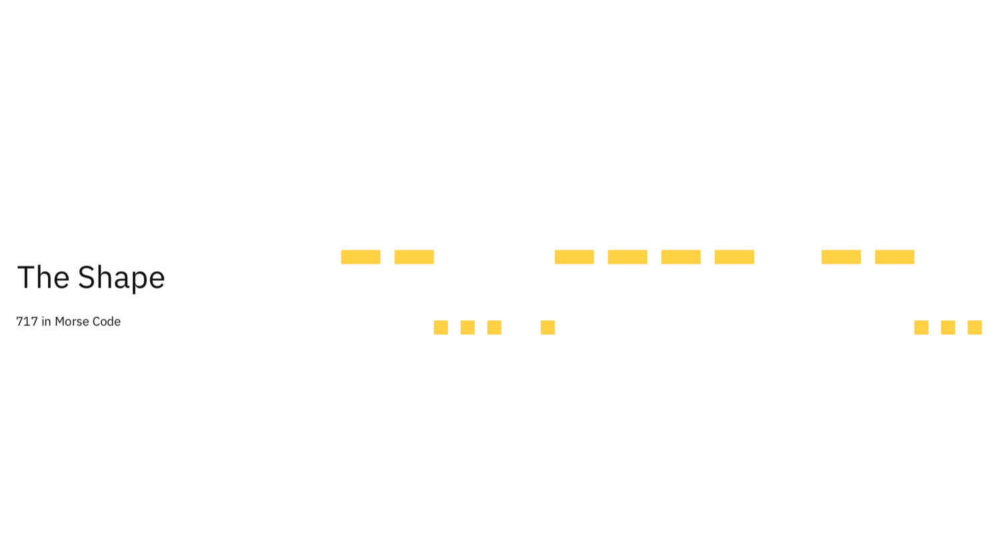
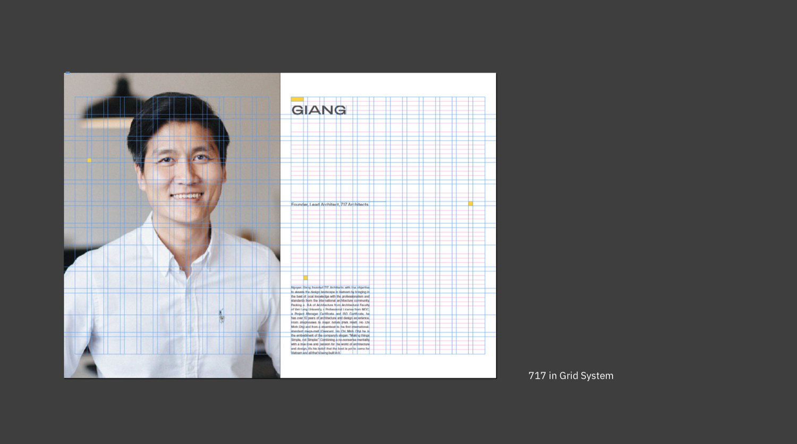

