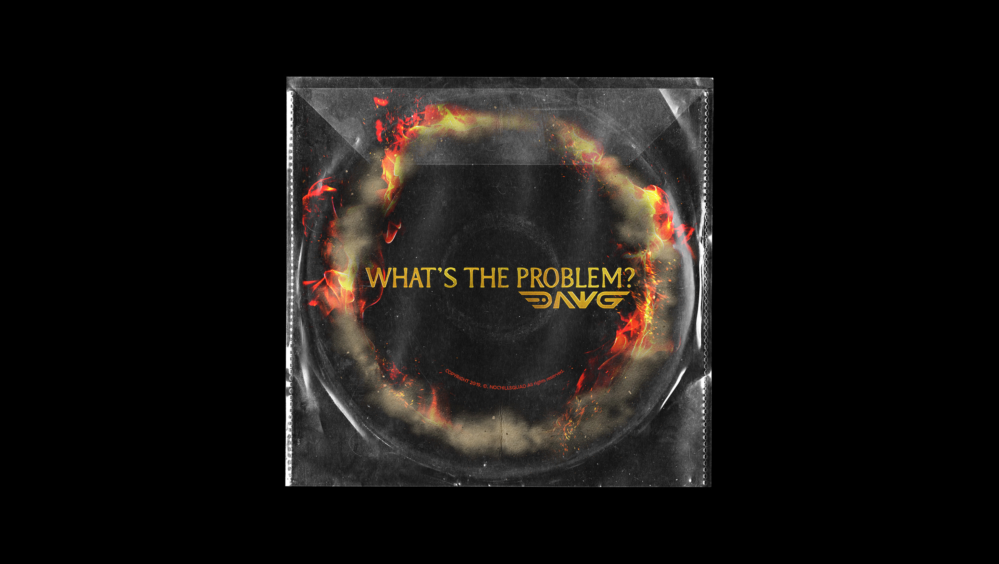
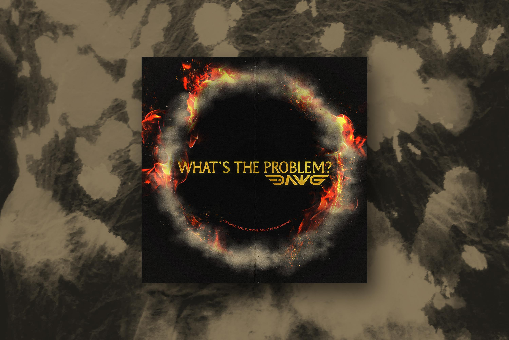
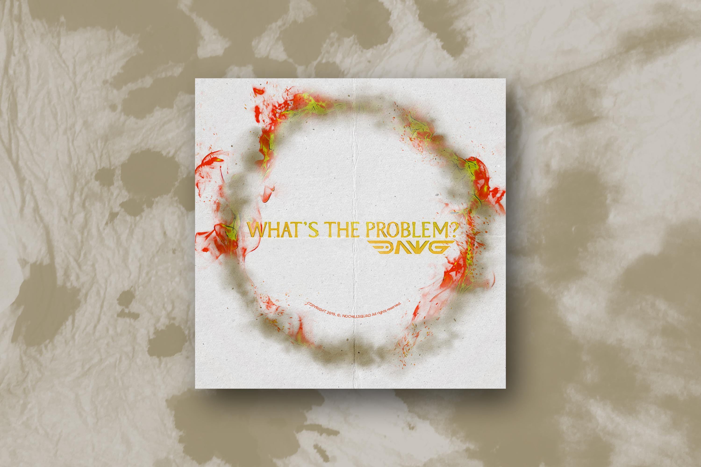
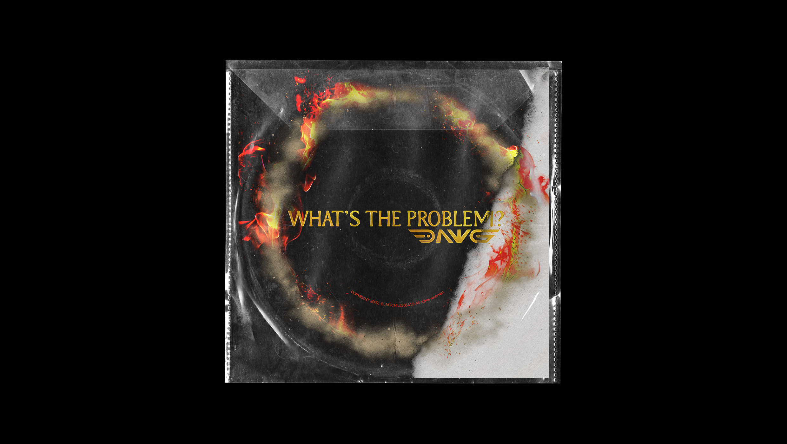
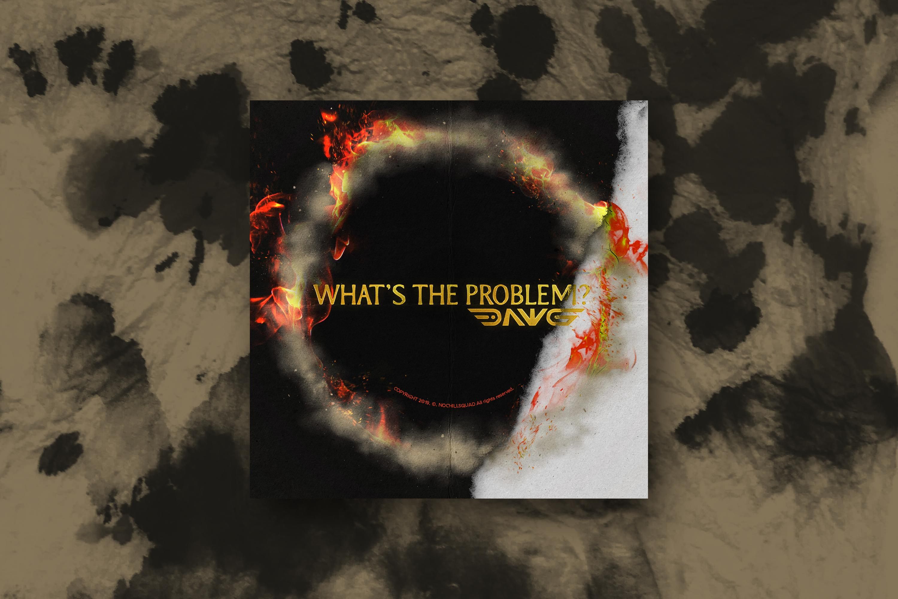
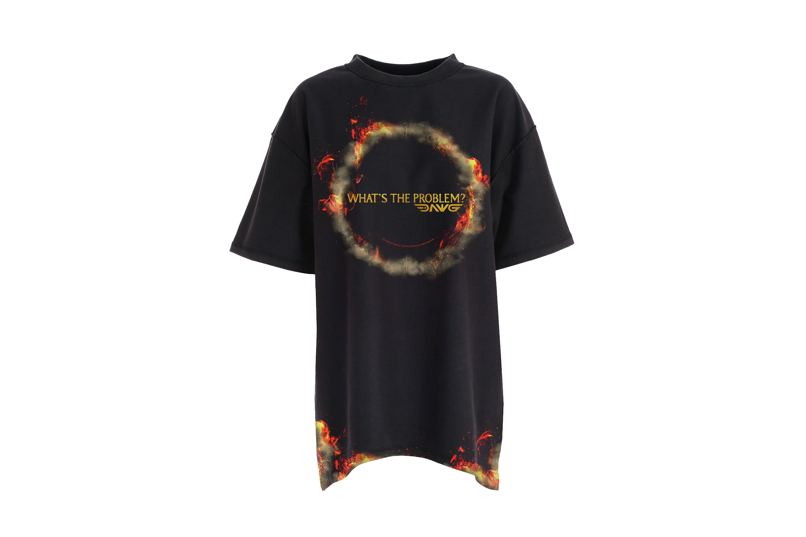

DAWG is an uprising underground rapper in Korean. Coincidently, we met through a friend of mine in Saigon then we decided to collab in his latest EP. The song was written about an old homie who has changed for fame and money while he keeps asking both himself and that fucker "What's the problem?". It's a "circle of friends" is burning down and turning to dust. The inner cycle is asking "What's the problem?" with a smiley face. 🙂

_Client: DAWG · Project: EP - Artwork · Location: Seoul, Korea · Time: 2020_

**Black Ver.**

**White Ver.**

**Split Ver.**

**Merchandise**

