As a designer and loyal patron, it's been my privilege to help shape the branding for Doppio Kaffè over the past 5 years. This charming coffee shop in Hanoi holds a special place in my heart. Back in 2018, I designed their friendly logo featuring hot air balloons drifting over the name "Doppio," Italian for double. Their signature double shots epitomize the warm, generous spirit of this cafe.

I wanted the branding to capture Doppio's cozy vibe - a welcoming oasis for savoring a slowly-sipped coffee. Soft textures, earth tones and handwritten fonts create a relaxed, living room feel.

As a regular, I often come here to recharge. It's a home away from home where you're always greeted with a smile. I'm honored my designs have helped this humble cafe share their passion over the years.

_Client: Doppio Kaffè · Project: Brand Identity · Location: Hanoi, Vietnam · Time: 2018_

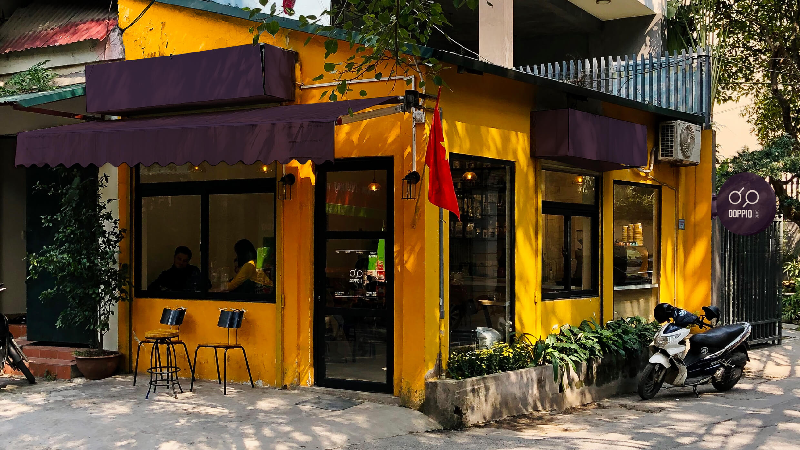

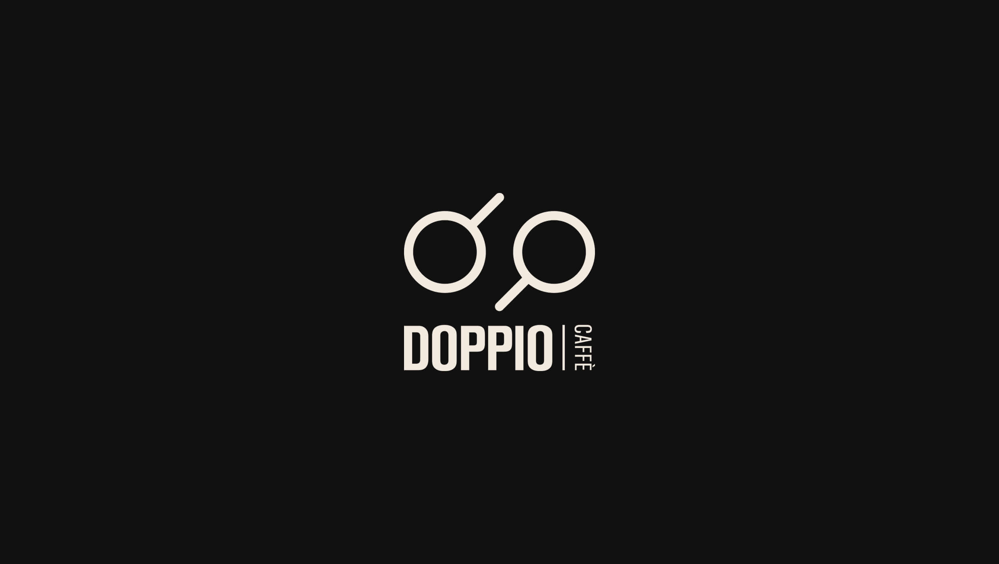

<!-- 2col -->

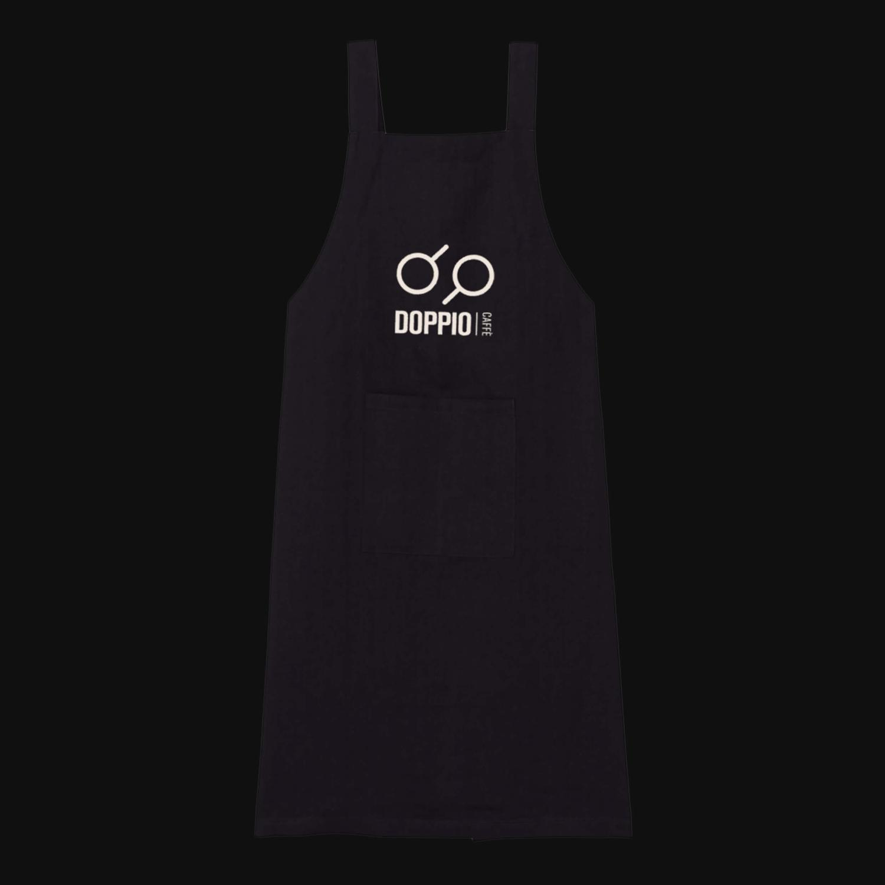
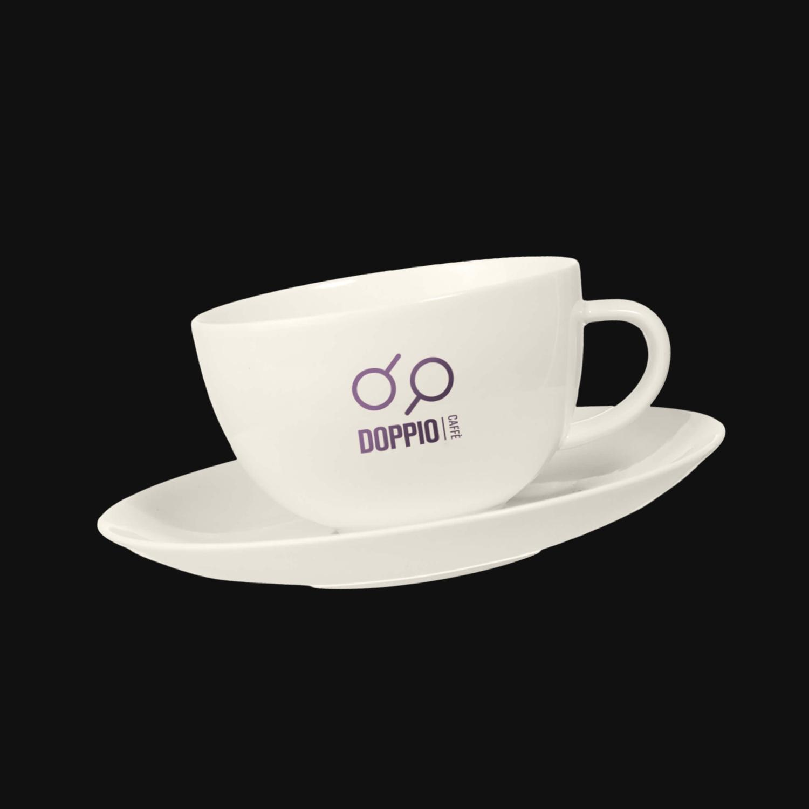

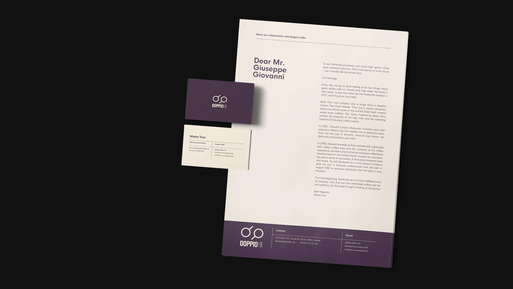

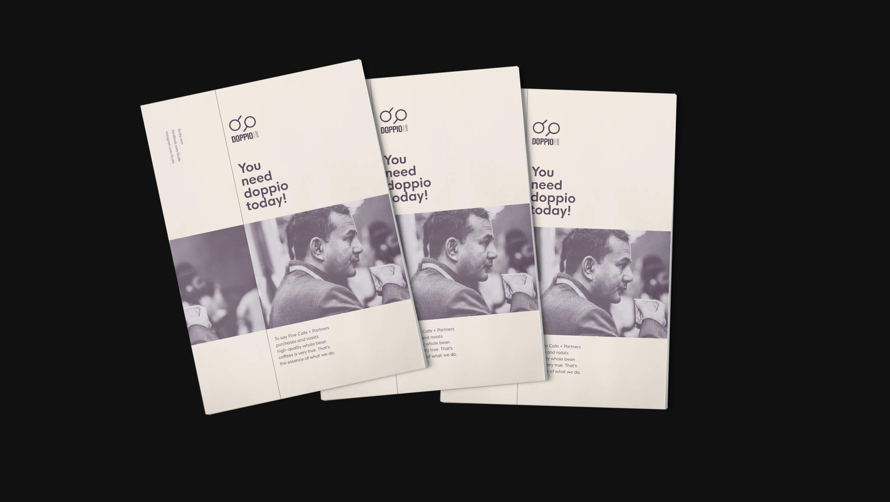

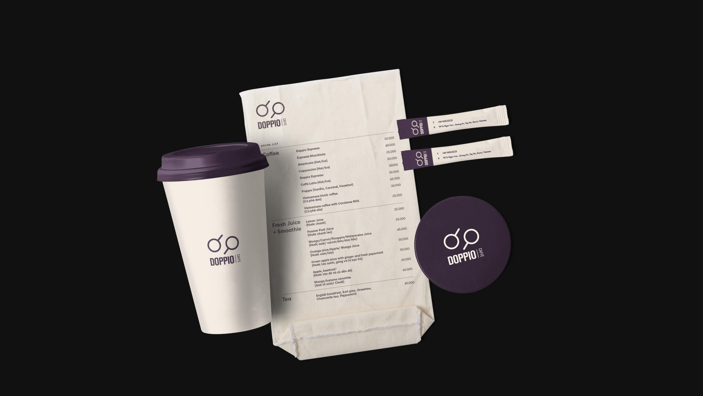

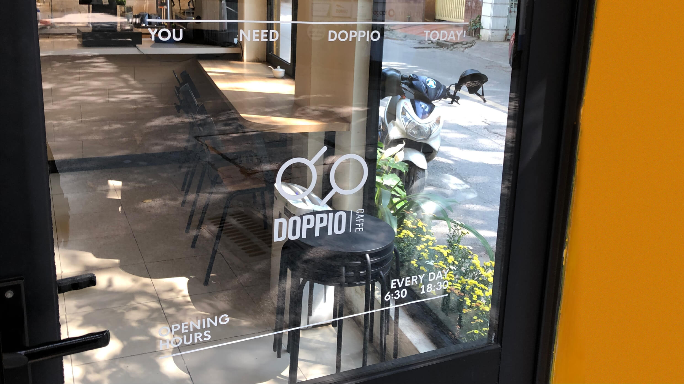

<!-- 2col -->

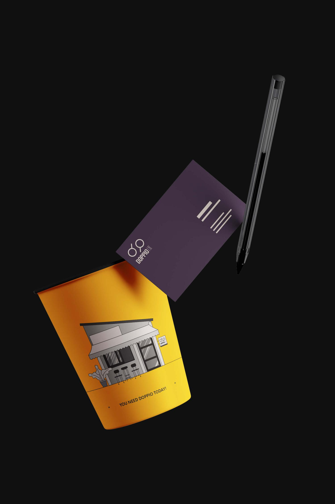
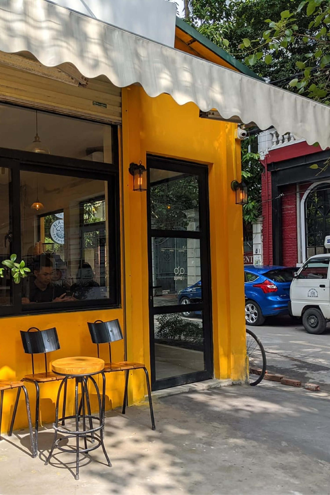

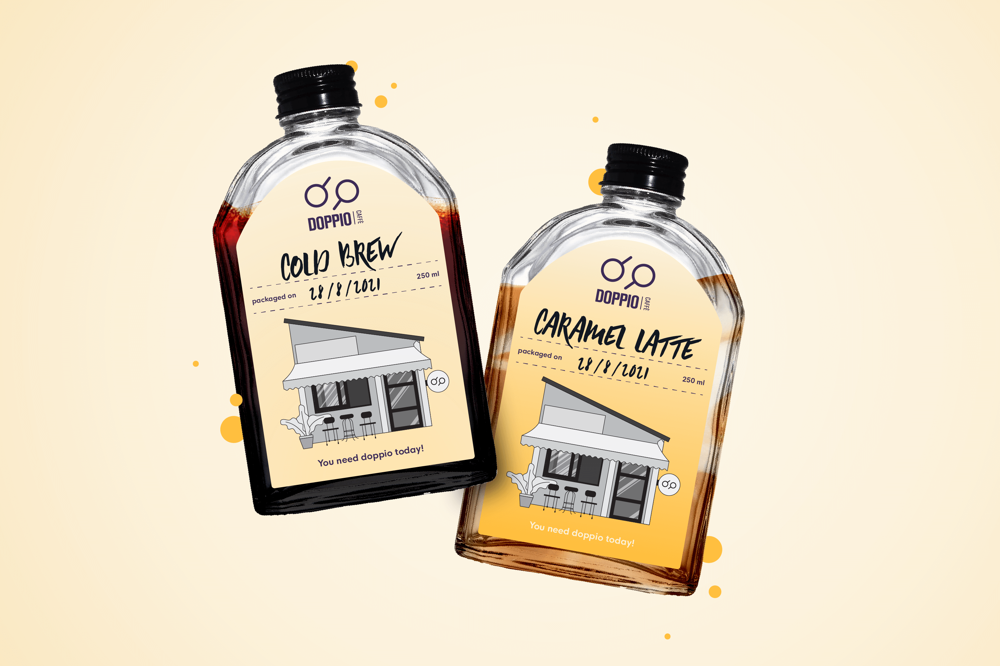
