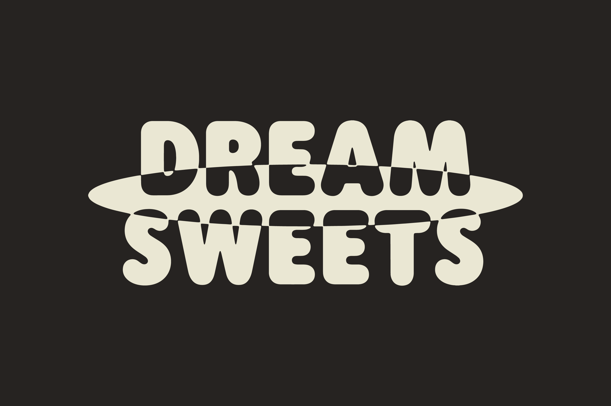
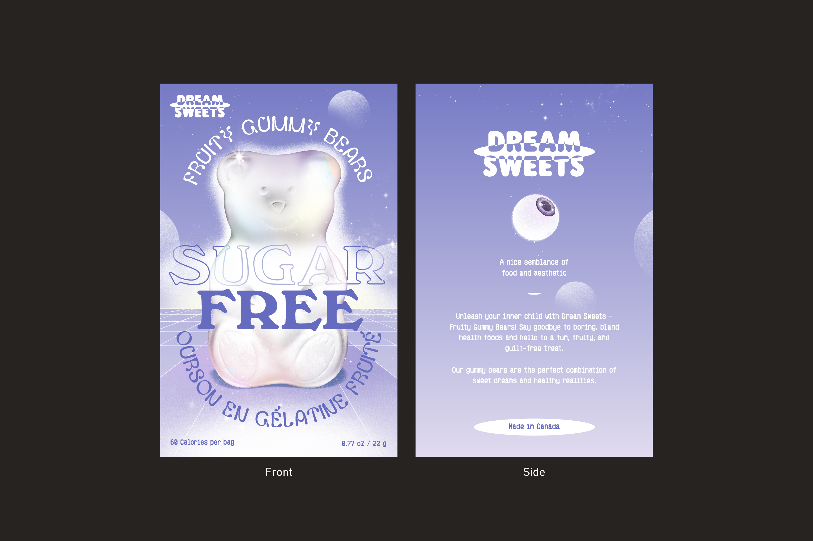
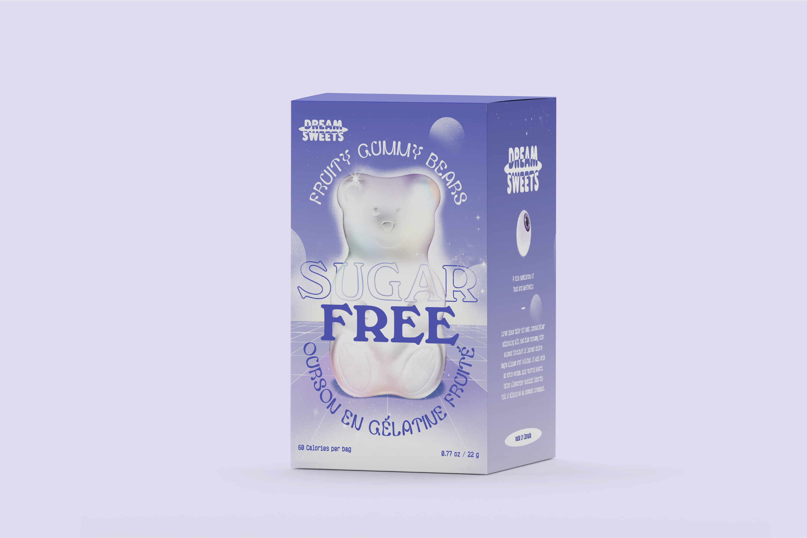
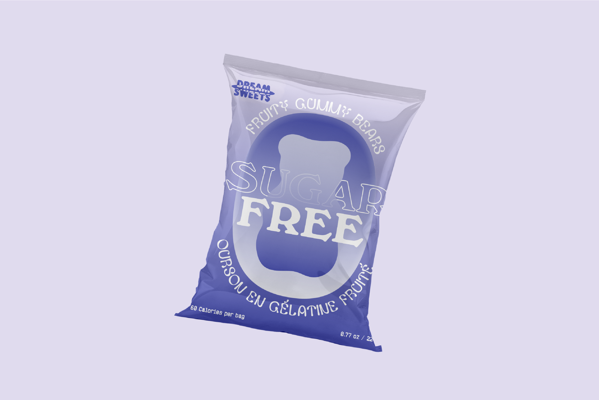
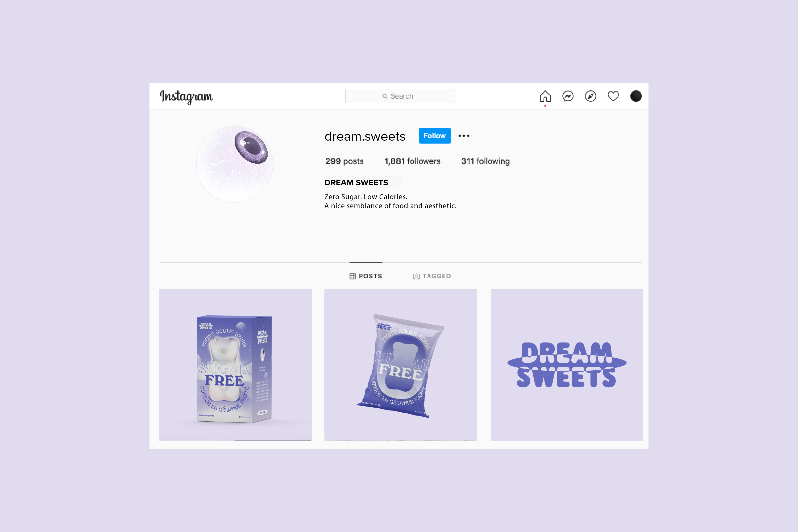

"Are you dreaming about sweets again?" Are you tired of sacrificing your sweet tooth for a healthy lifestyle? Look no further, Dream Sweets has got you covered! The Zero Sugar and Low Calorie Gummy Bears are the perfect solution for anyone who wants to enjoy sweets without the guilt or negative consequences.

The brand identity was designed with a focus on health, wellness, and joy. The logo is inspired by a mouth and teeth, symbolizing the dream of being able to eat sweets without worries.

*Client: Dream Sweets · Project: Brand Identity, Brand Story, Naming, Brand Message & Communication · Location: Canada · Time: 2021*

