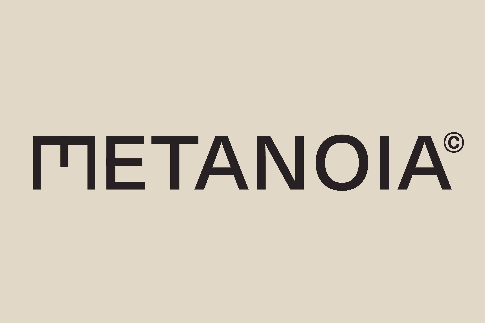
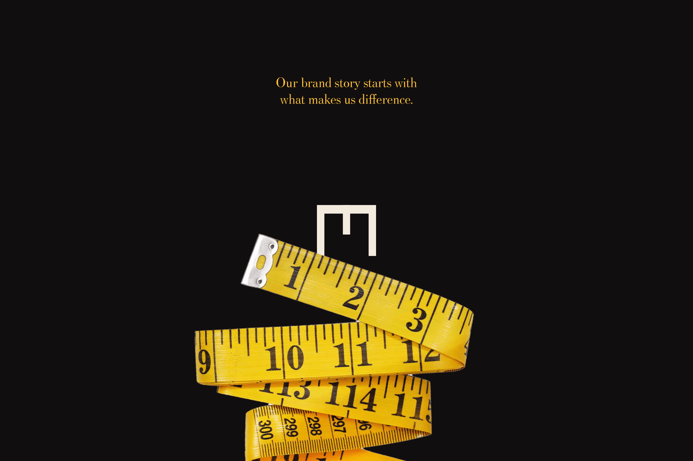
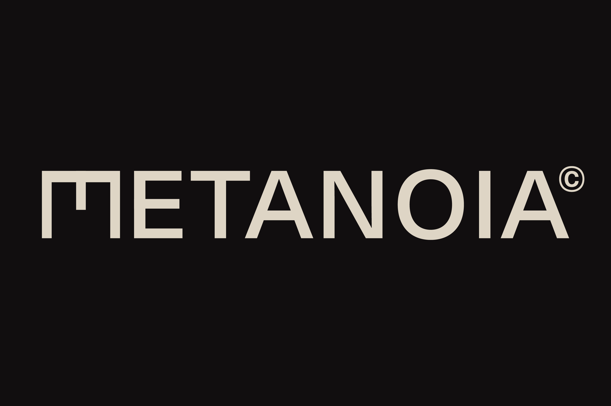
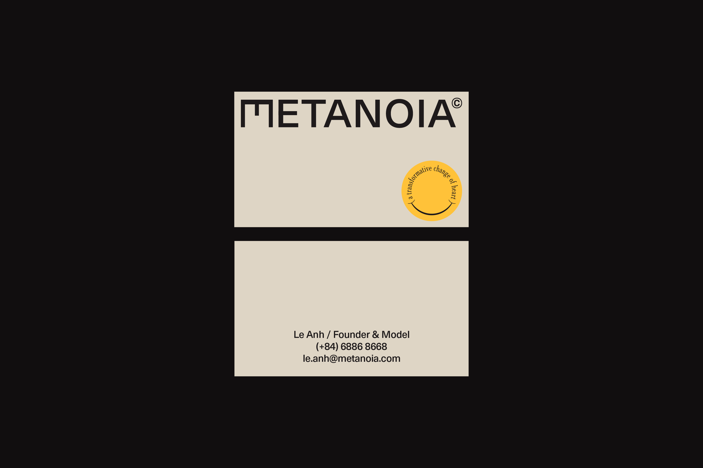
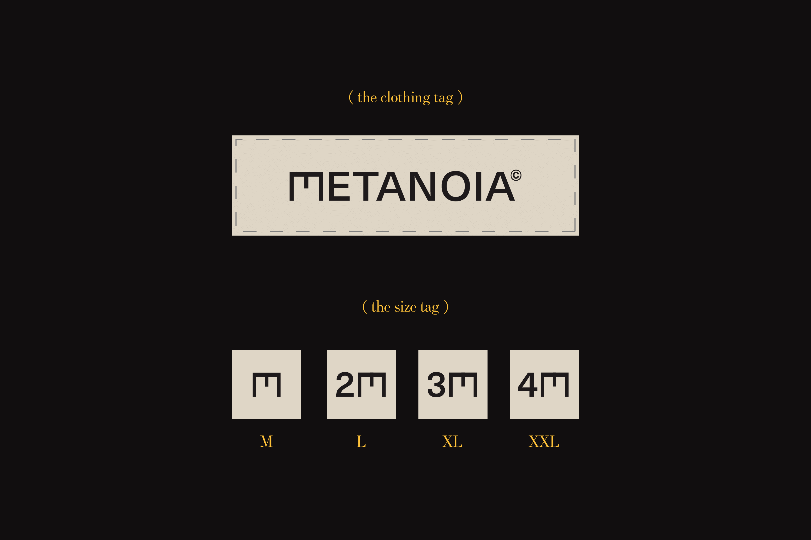
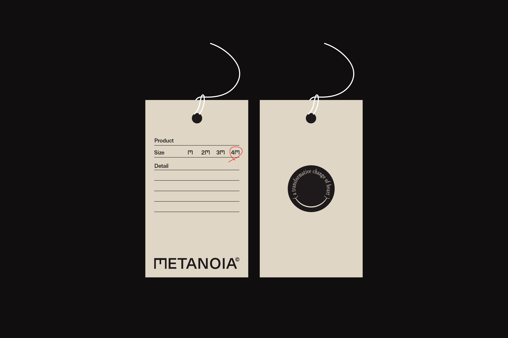
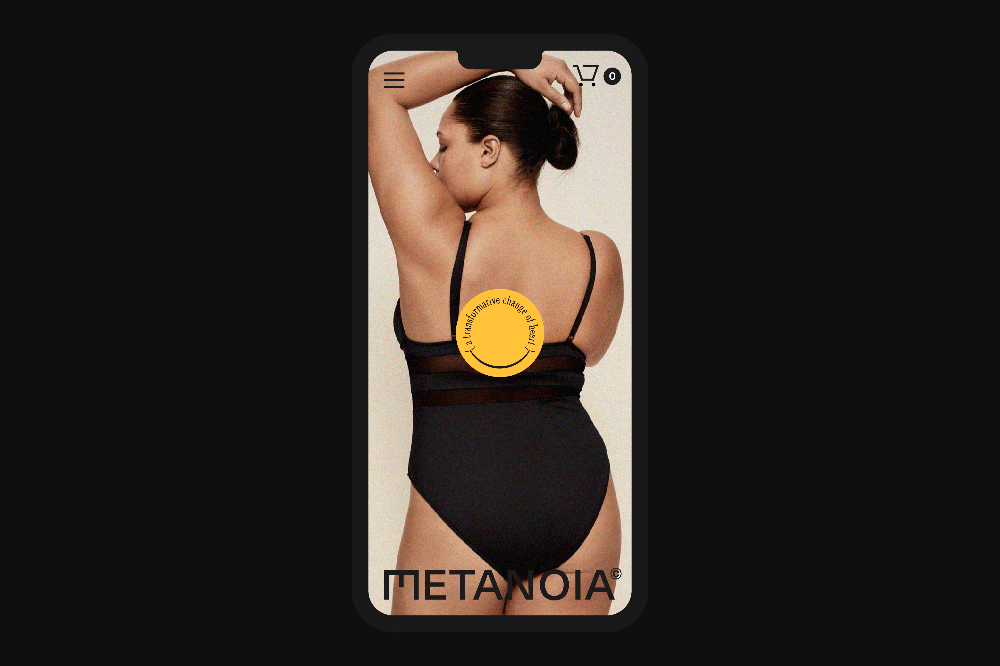
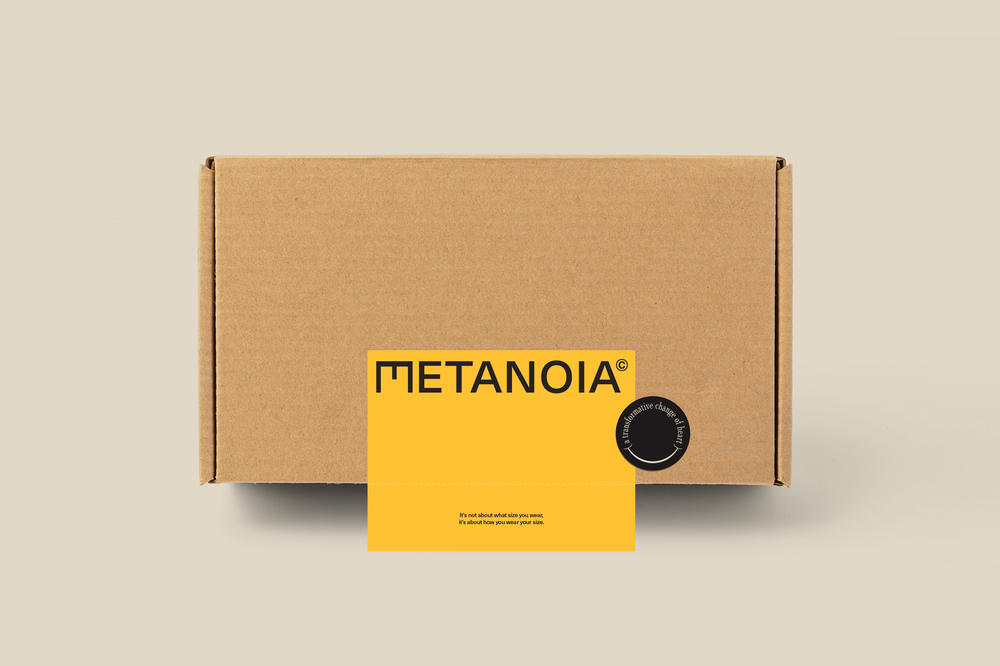

"Shut up! You are not fat, you are beautiful!". Metanoia is a clothing brand that filling the gap of luxury fashion for plus-size people in Vietnam. We believe plus-size clothes is not just bigger size but should make us feel as remarkable as we are. The name Metanoia means "a transformative change of heart" as they support change themselves. Every customer who comes back with a loss of weight can get a discount.

_Client: Metanoia© · Project: Brand Identity design · Location: Hanoi, Vietnam · Time: 2021_

