Namka Coffee is a Vietnamese coffee and roaster specialized in delivering clean & high-quality coffee products in Vietnam. Namka is the name of a mountain which is the symbol of Buon Ma Thuot - Viet's Capital of Coffee.

The logo I created features the silhouette of Mount Namka, an iconic peak that towers over Buon Ma Thuot region, Vietnam's coffee capital. The mountainscape honors the company's origins while conveying natural purity and craftsmanship. I developed branding that mirrors Namka's commitment to quality, from the packaging to the retail space. Clean black, white and wood tones create an upscale yet welcoming vibe. The bags showcase the brand's meticulous small-batch roasting process. Purposeful design choices, from the logo to the typography, work together to tell Namka's story as proud Vietnamese coffee curators. It was an honor to produce branding assets that reflect their team's passion and help spread the taste of Vietnam worldwide. The end result is a memorable brand identity that evokes Vietnam's coffee heritage, connecting with consumers seeking exceptional flavor and conscientious craftsmanship.

_Client: Namka Coffee · Project: Brand Identity · Location: Vietnam · Time: 2018_

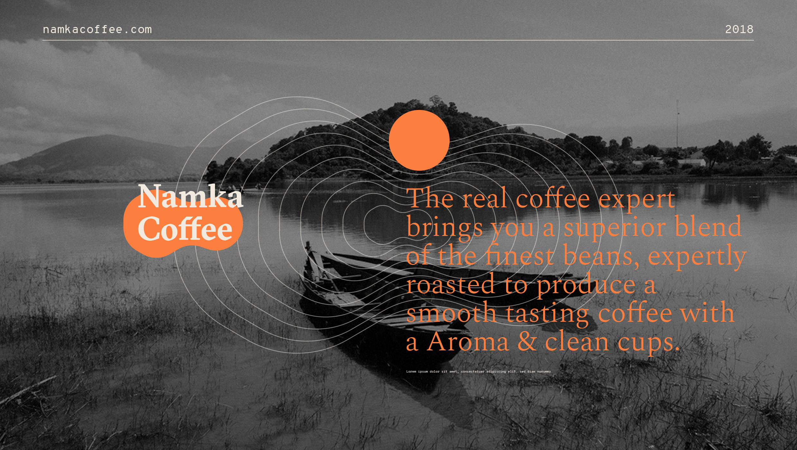

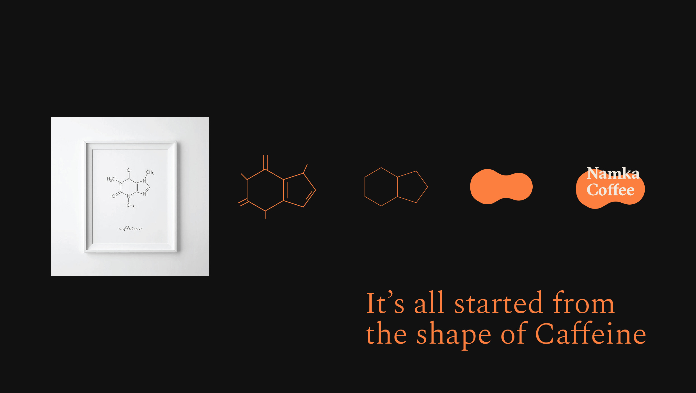

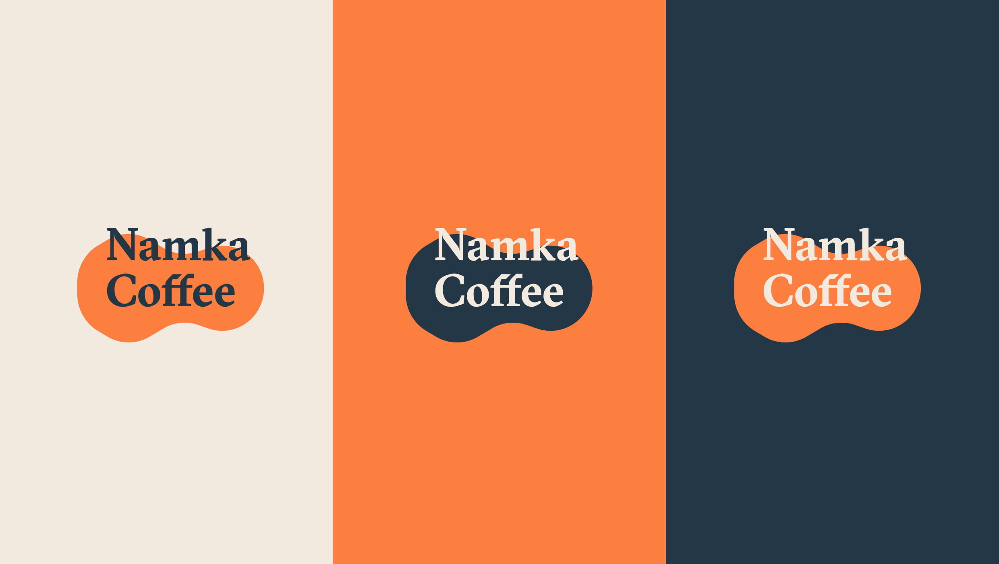

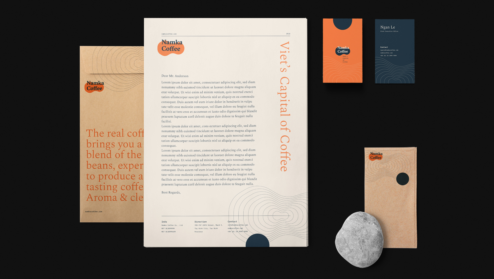

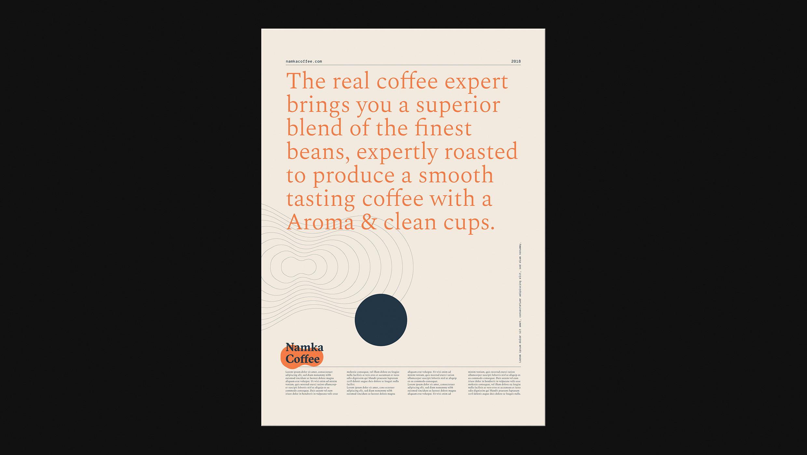

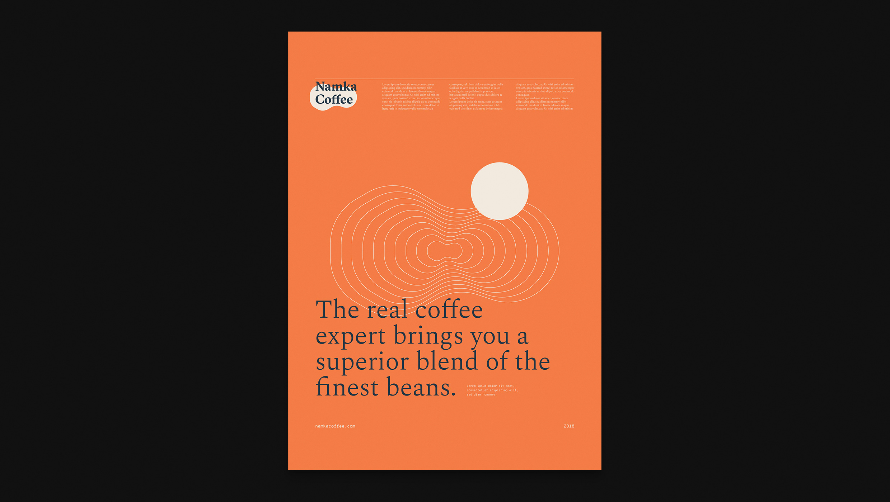

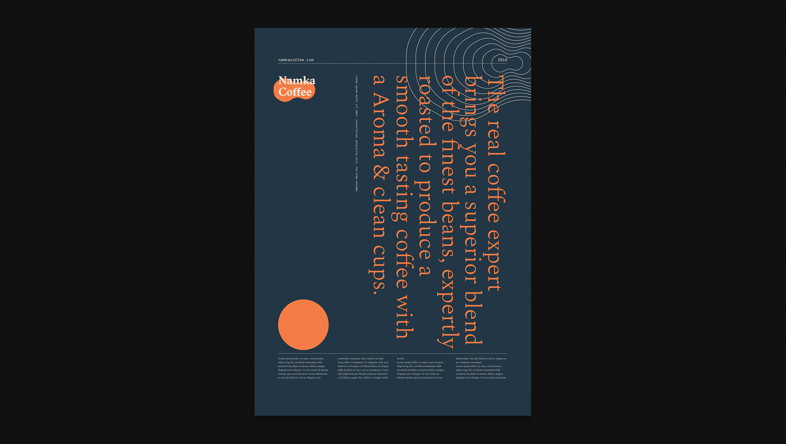

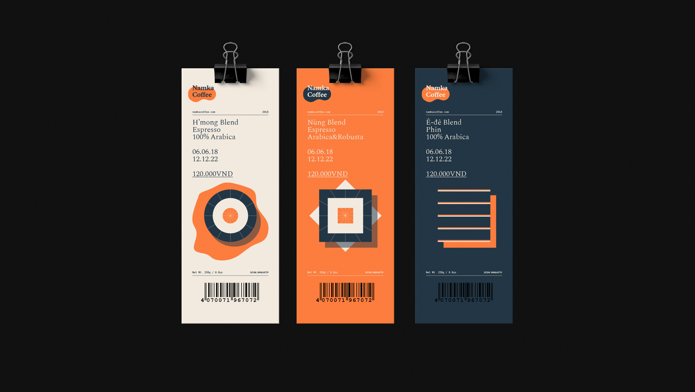

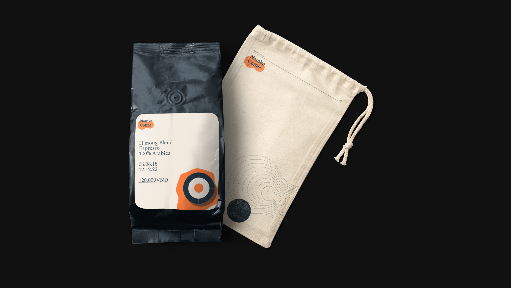

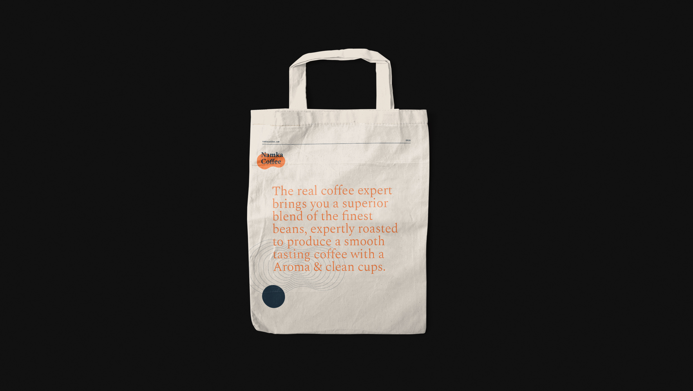

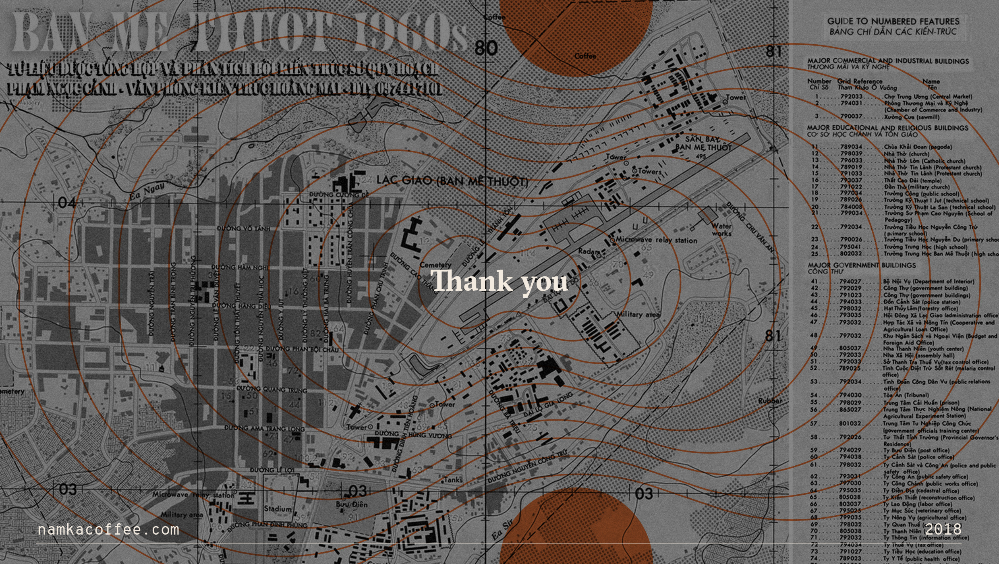
