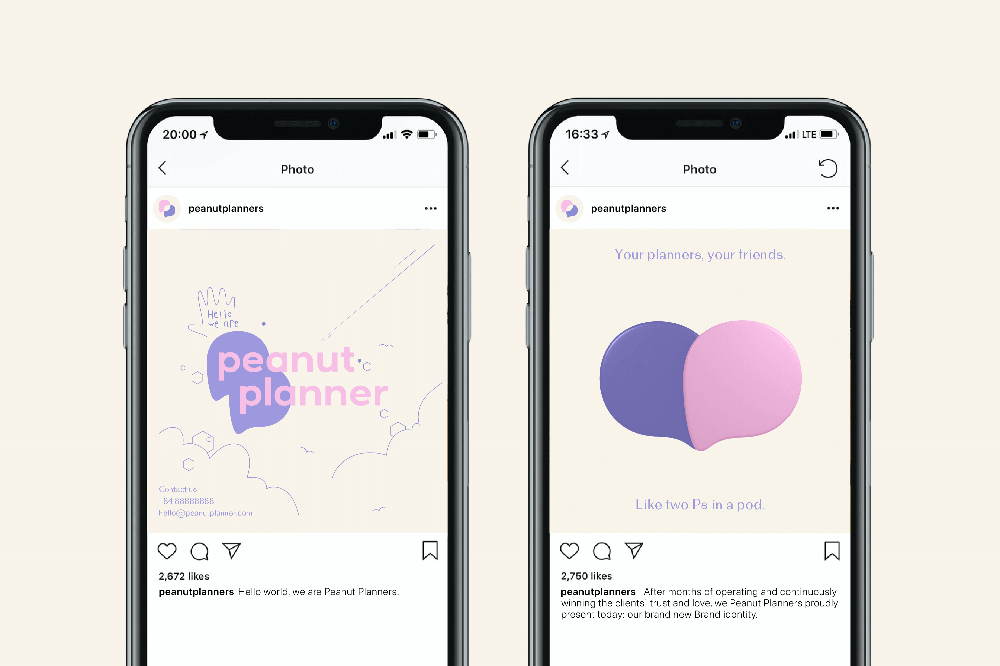

Peanut Planner is a Saigon-based event and wedding planners. Inspired by the idea of the "hidden" nutrition value inside the peanut itself, the team requested to sketch an identity that is both humble and shining in a friendly, elegant way.

*Client: Peanut Planner · Project: Brand Identity · Location: HCMC, Vietnam · Time: 2021*

<!-- 2col -->

