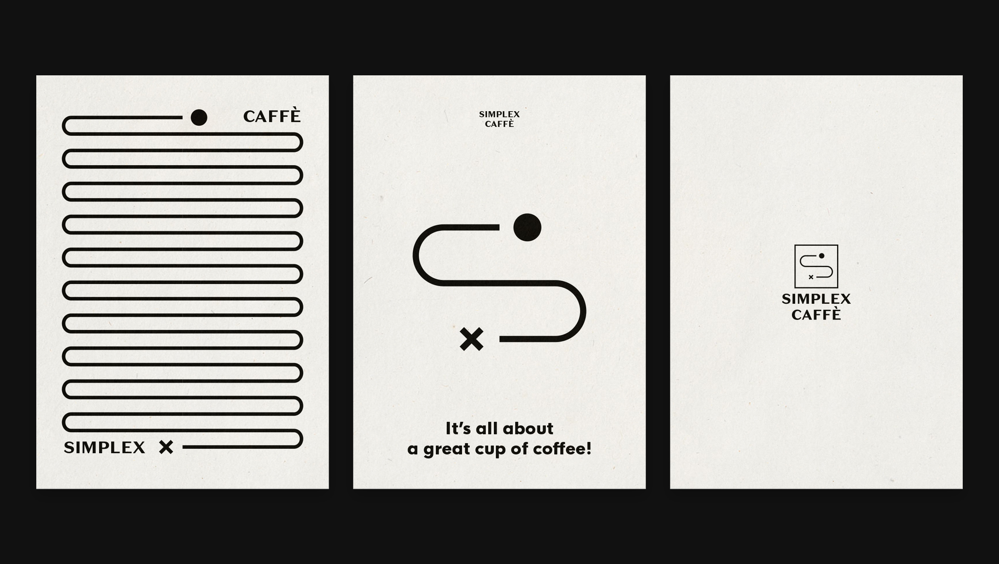
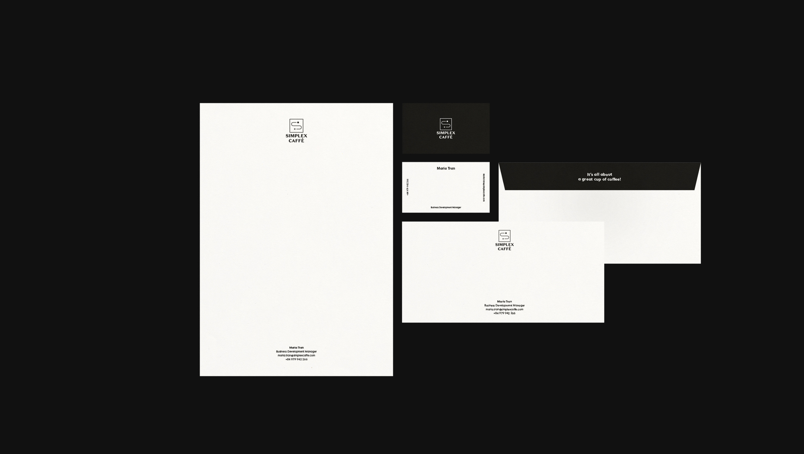
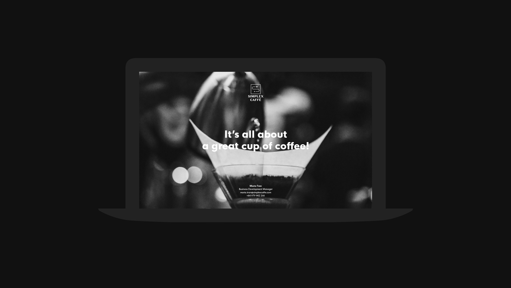
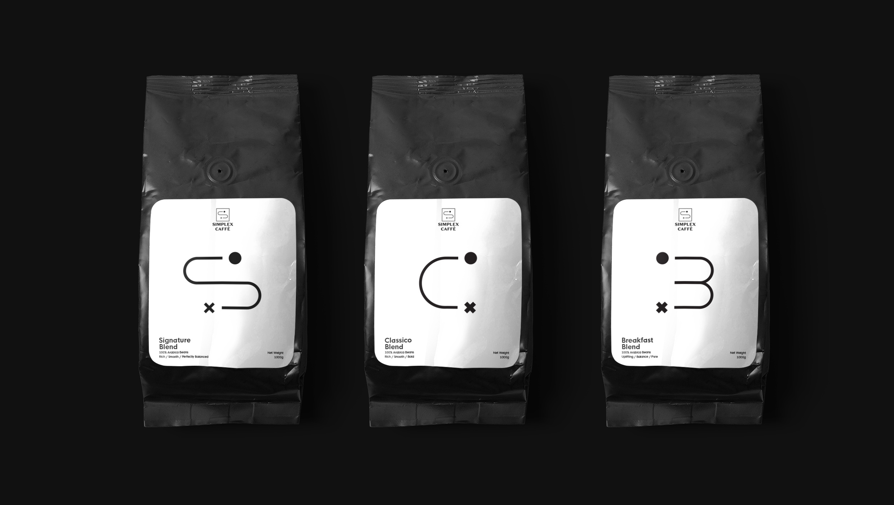
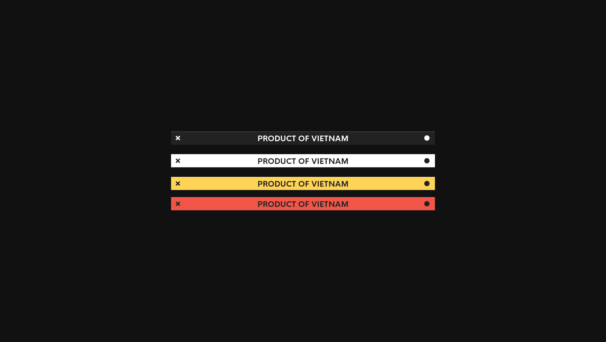
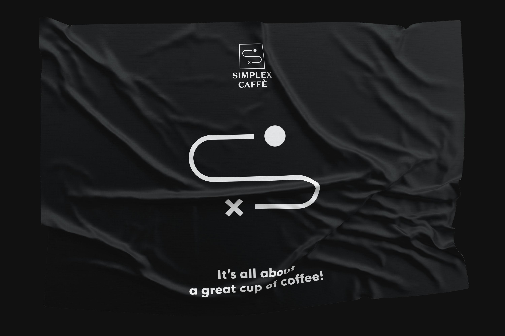

Simple and Excellent coffee is what SIMPLEX CAFFE stands for. Founded in 2013, we are taking our responsibility of sustaining the future of Vietnamese coffee on the international coffee map. In both retail and food & beverage service section, our coffee blends are playing crucial role of shaping the Vietnamese café culture.

*Client: Simplex Caffè · Project: Brand Identity, Design Consultant · Location: Vietnam · Time: 2019*

