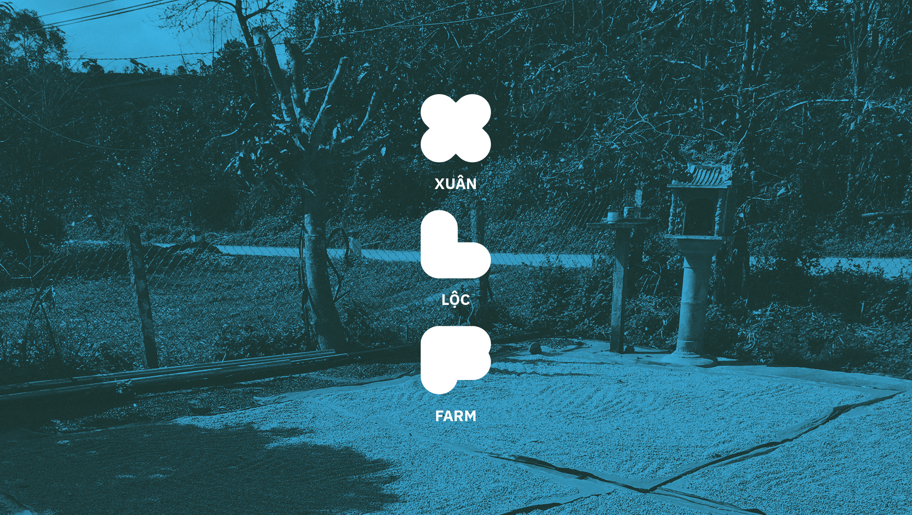
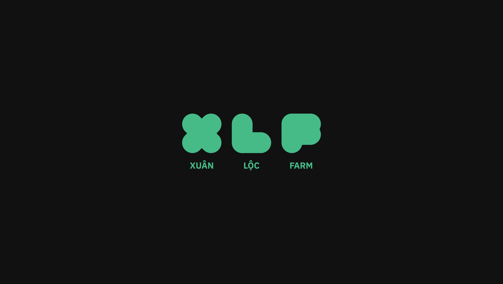
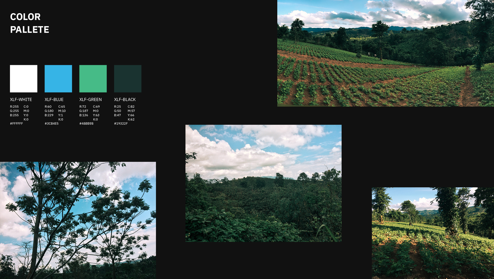
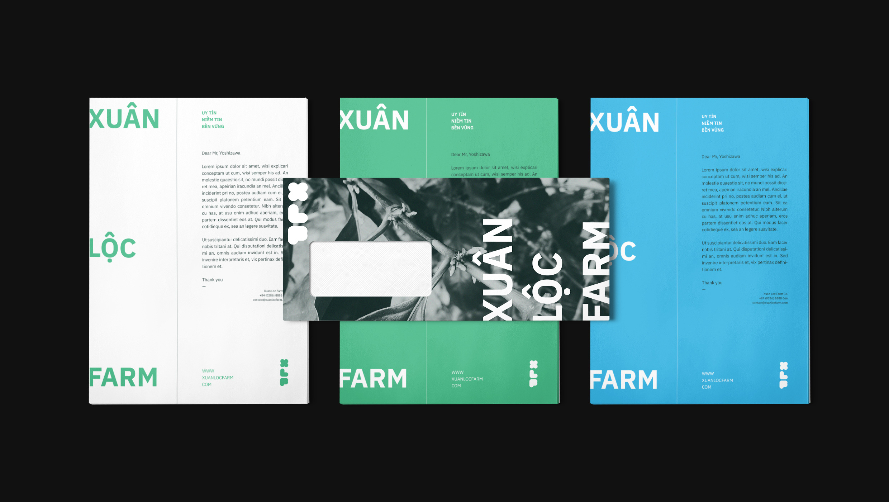
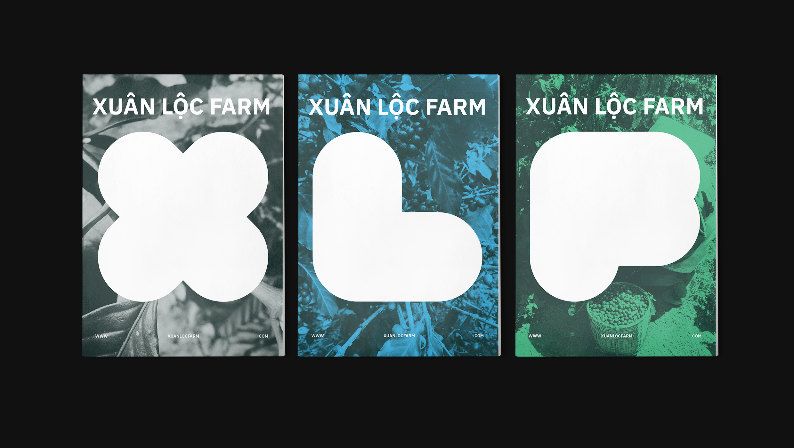
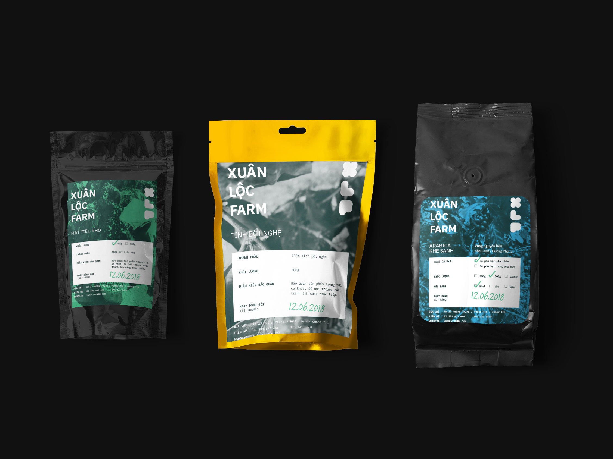
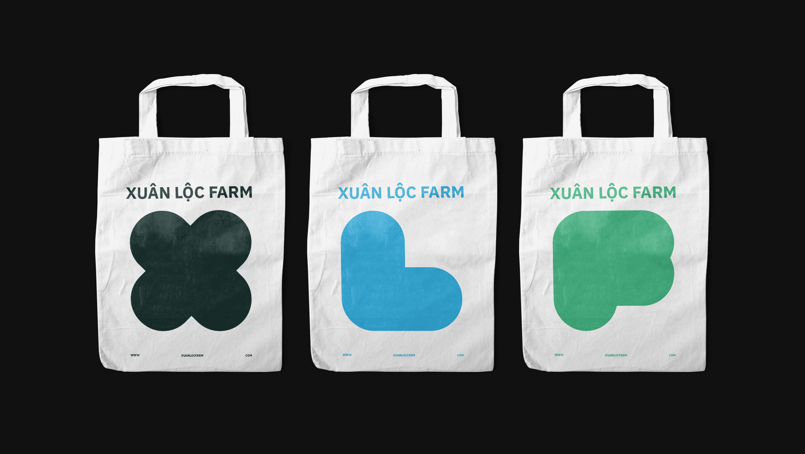
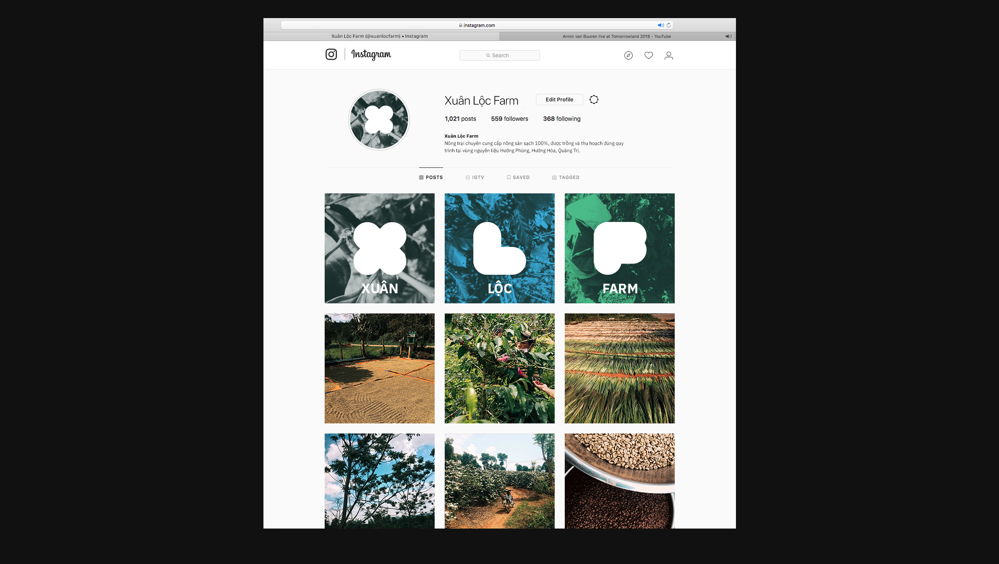
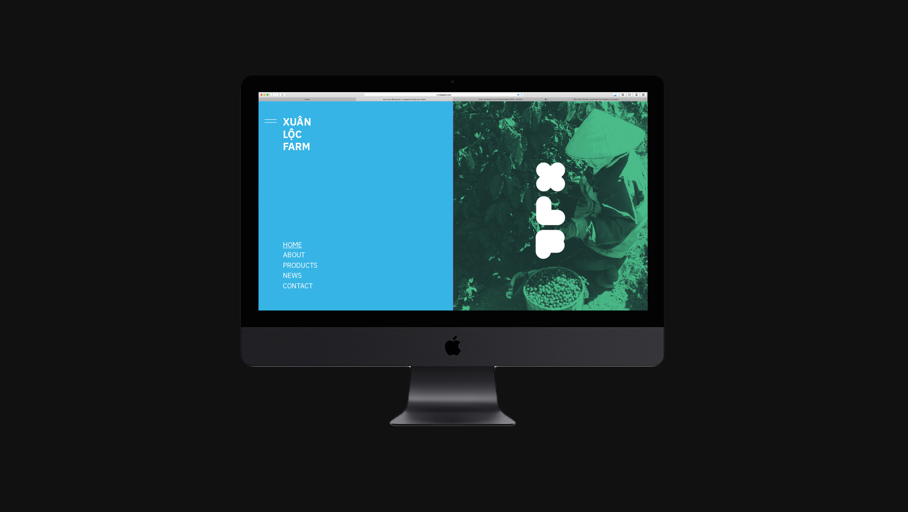
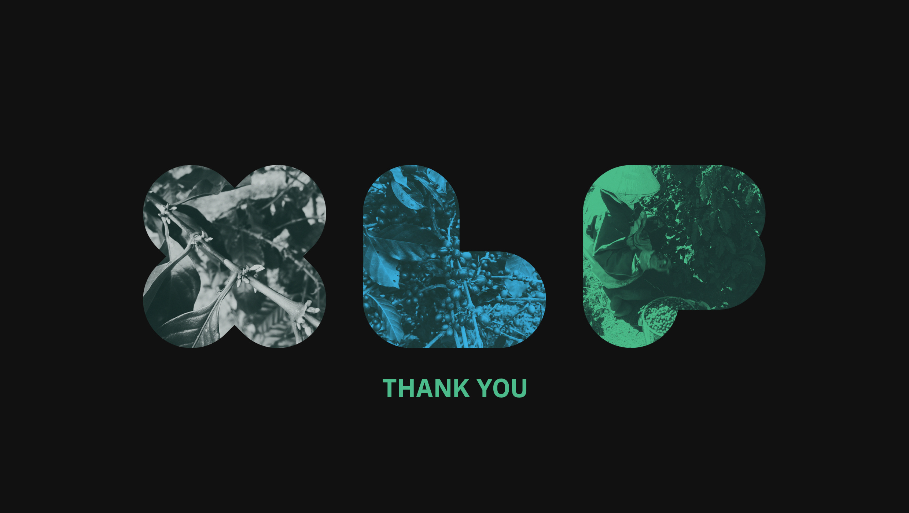

When family-owned Xuan Loc Farm approached me to develop their brand identity, they wanted to convey the realness and honesty of small-scale Vietnamese agriculture. I designed a logo, packaging, and other brand assets that evoked the 'wild and lightly cold' feeling of farming in the mountains. Through earthy textures and tones, I helped Xuan Loc Farm authentically represent Vietnamese farmers.

*Client: Xuan Loc Farm · Project: Brand Identity · Location: Quang Tri, Vietnam · Time: 2018*

